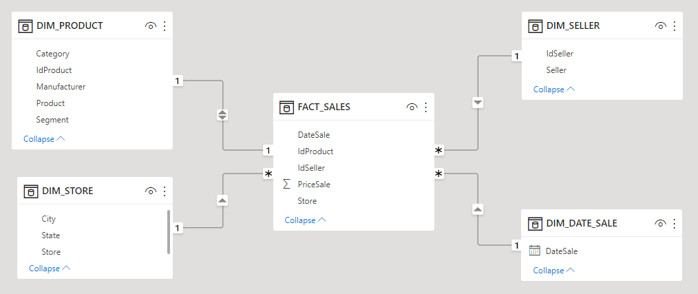

# UNDER CONSTRUCTION

# Health Plan Operator Expenses

## 1. Business Problem
**Context:** _____________
**Data source:** Excel file with data collected from the company's sales, CRM and ERP system, with the following columns:
* IdProduct: Unique identifier for each product
* Product: Product name
* Category: Product Category
* Segment: Product segment
* Manufacturer: Product manufacturer
* Store: Store where the sale was made
* City: City of the store where the sale was made
* State: State of the store where the sale was made
* Seller: Seller's name
* IdSeller: Seller-ID
* DateSale: Date of sale
* PriceSale: Amount of sale

**Project goals:** Create a DASHBOARD that answers the following questions, in addition to other relevant analysis to the business:

  1. Which of the manufacturers of the products sold has the best sales performance?
  2. What is the total sales by state and by category?
  3. What is the total sales by segment?
  4. Which segment has the greatest influence on the average sales value?

## 2. Data modeling
After loading the data into Power BI from excel format, transformations and modeling were carried out, as follows:

  

## 3. Data visualization
Dashboard created on Power BI:

  

