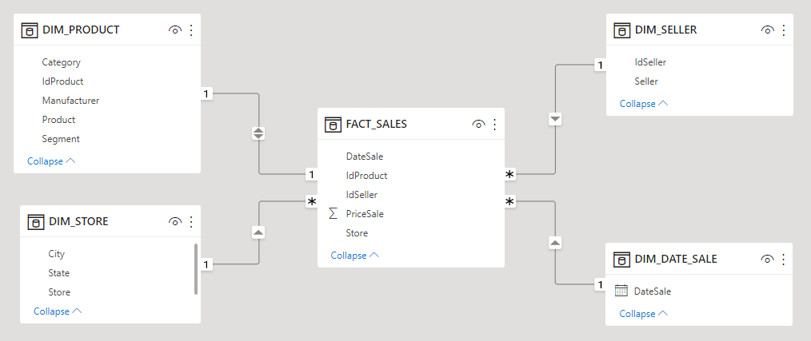
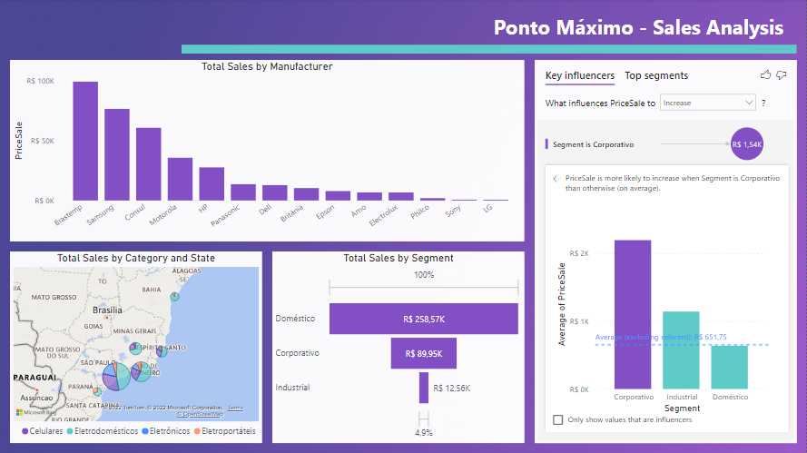

# Defining Sales Strategies

## 1. Business Problem
**Context:** The company PontoMaximo is a fictitious retail chain that sells electronics and home appliances with stores spread across several cities in Brazil. The company started its operation in Brazil in 2012 and operates in the four states of the Southeast region plus the states of Paraná and Bahia. The company is setting up its sales strategy for the next year and needs to know which of the manufacturers of the products sold has the best sales performance. The objective is to discard manufacturers whose products have few sales and try to negotiate better conditions with the main manufacturers. In parallel to this, the company would like to have different views of the sales made in the last 4 years (period from 2012 to 2015). It should be possible to segment sales reports by different information and from different angles. This information will support the company's strategies for the coming year.

**Data source:** Excel file with data collected from the company's sales, CRM and ERP system, with the following columns:
* IdProduct: Unique identifier for each product
* Product: Product name
* Category: Product Category
* Segment: Product segment
* Manufacturer: Product manufacturer
* Store: Store where the sale was made
* City: City of the store where the sale was made
* State: State of the store where the sale was made
* Seller: Seller's name
* IdSeller: Seller-ID
* DateSale: Date of sale
* PriceSale: Amount of sale

**Project goals:** Create a DASHBOARD that answers the following questions, in addition to other relevant analysis to the business:

  1. Which of the manufacturers of the products sold has the best sales performance?
  2. What is the total sales by state and by category?
  3. What is the total sales by segment?
  4. Which segment has the greatest influence on the average sales value?

## 2. Data modeling
After loading the data into Power BI from excel format, transformations and modeling were carried out, as follows:

  

## 3. Data visualization
Dashboard created on Power BI:

  

