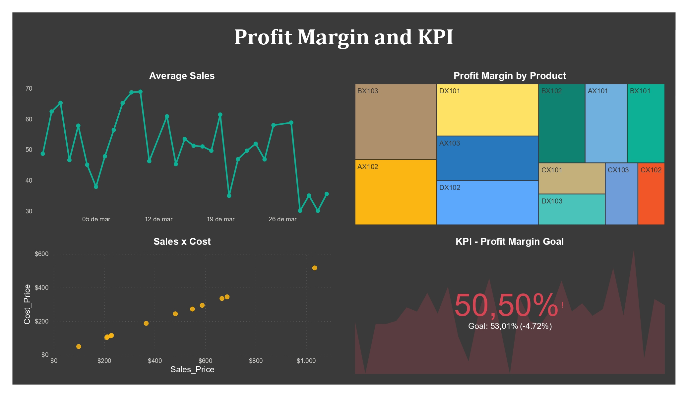
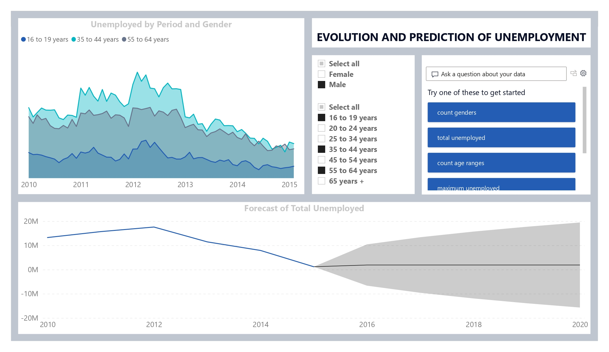
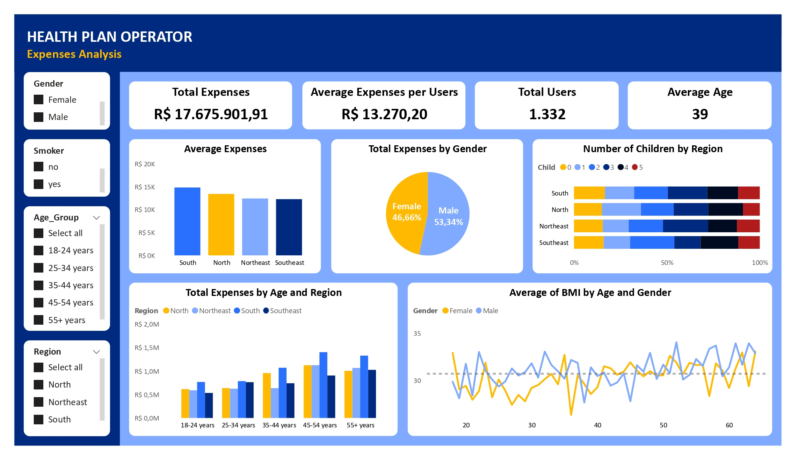

# Microsoft-Power-BI-for-Data-Science
This repository contains learnings acquired during the DataScience Academy's Microsoft Power BI for Data Science course.
All data here is fictitious and is intended to improve data analytics's skills

## Case Study 1: [Car Sales Company](https://github.com/fillipessampaio/Microsoft-Power-BI-for-Data-Science/blob/main/Mod2_CarSalesCompany.md)

  

## Case Study 2: [Defining Sales Strategy](https://github.com/fillipessampaio/Microsoft-Power-BI-for-Data-Science/blob/main/Mod3_Defining_Sales_Strategies.md)

  

## Case Study 3: Profit Margin and KPI

  

## Case Study 4: Evolution and Prediction of Unemployment

  

## Case Study 5: Geolocation and Mapping customer's bank balances

  

## Case Study 6: [Analysis of Expenses of Health Plan Operators](https://github.com/fillipessampaio/Microsoft-Power-BI-for-Data-Science/blob/main/Health_Plan_Operator_Expenses.md)

  

