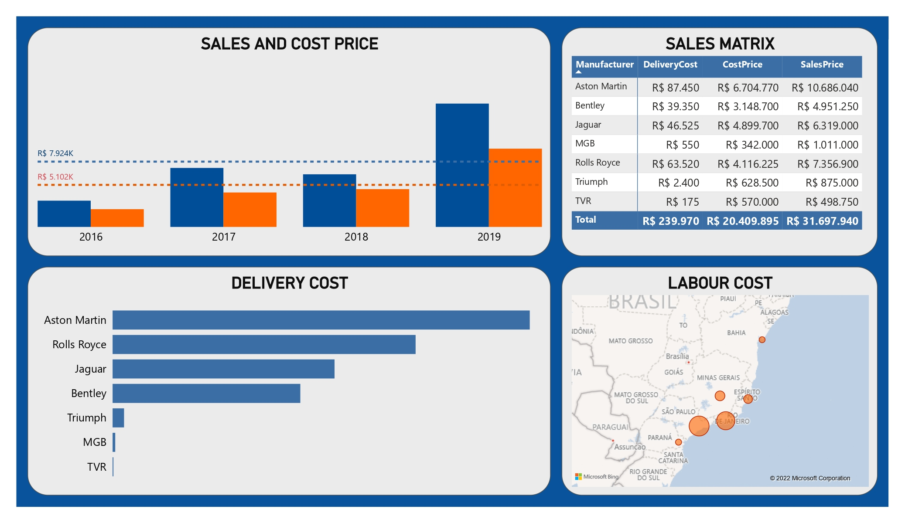

# Dashboard of a Car Sales Company

## 1. Business Problem Definition
**Context:** The company XYZ Corporation International, a luxury car dealership based in São Paulo, started its operation in Brazil in 2016, operating in the states of São Paulo, Minas Gerais, Rio de Janeiro, Espírito Santo, Paraná and Bahia.The manager will present the results of the commercial team to the new CEO of the company and needs to create a Dashboard that represents the sales data in the period from 2016 to 2019.

**Data source:** Excel file with data collected from the company's sales and CRM system, with the following columns:
* DateInvoice: Issue date of the invoice
* Manufacturer: Vehicle manufacturer
* State: State where the sale took place
* SalesPrice: Vehicle sales price
* CostPrice: Cost price of the vehicle for the company
* TotalDiscount: Total Discount provided on the sale price
* DeliveryCost: Cost of delivering the vehicle to the owner
* LabourCost: Cost of Labor (desk, mechanic, etc...)
* CustomerName: Name of the customer who purchased the vehicle
* Model: Vehicle model
* Color: Vehicle color
* Year: Year of vehicle manufacture

**Project goals:** Create a DASHBOARD that represents the sales data in the period from 2016 and 2019 and answer the following questions, in addition to other analysis relevant to the business:

  1. Total sales by year and by state
  2. Vehicle delivery cost by manufacturer
  3. Labor cost by state
  4. Total sales and sales matrix

## 2. Data preparation
After loading the data into Power BI from excel format, transformations were performed using Power Query Editor, as follows:
```
Source = Excel.Workbook(File.Contents("E:\__file_path__.xlsx"), null, true),
CarSales_Sheet = Source{[Item="CarSales",Kind="Sheet"]}[Data],
#"Promoted Headers" = Table.PromoteHeaders(CarSales_Sheet, [PromoteAllScalars=true]),
#"Changed Type" = Table.TransformColumnTypes(#"Promoted Headers",{{"DateInvoice", type date}, {"Manufacturer", type text}, {"State", type text}, {"SalesPrice", Currency.Type}, {"CostPrice", Currency.Type}, {"TotalDiscount", Currency.Type}, {"DeliveryCost", Currency.Type}, {"LabourCost", Currency.Type}, {"CustomerName", type text}, {"Model", type text}, {"Color", type text}, {"Year", type text}})
```

## 3. Data modeling
No data modeling was needed.

## 4. Data visualization
Dashboard created on Power BI:
<p align="center">  </p>
